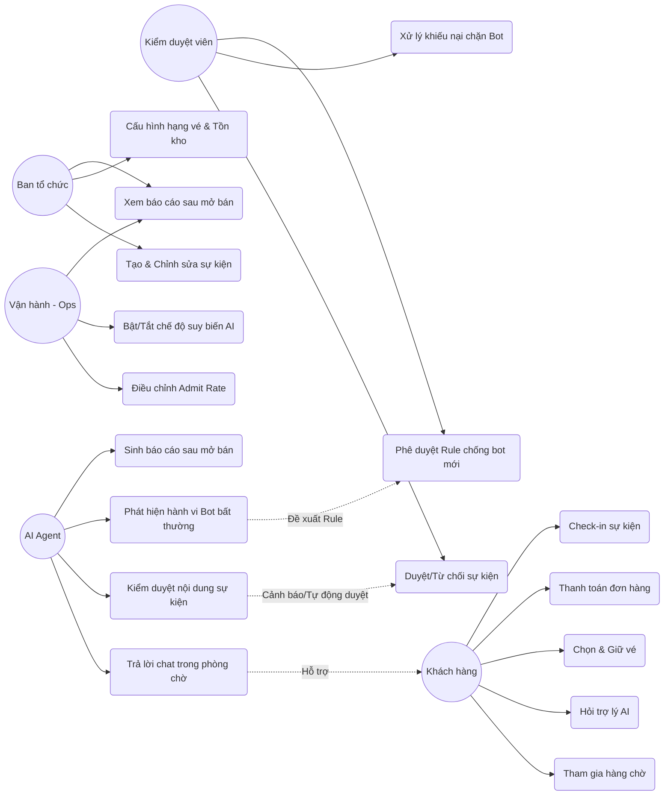
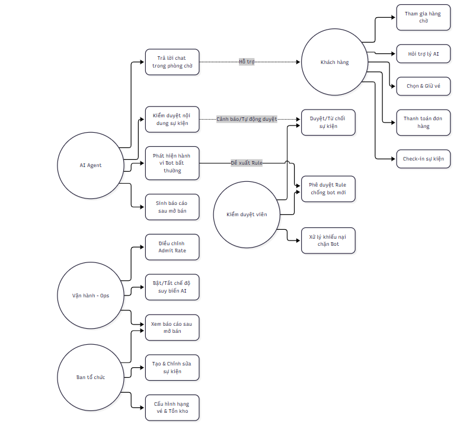
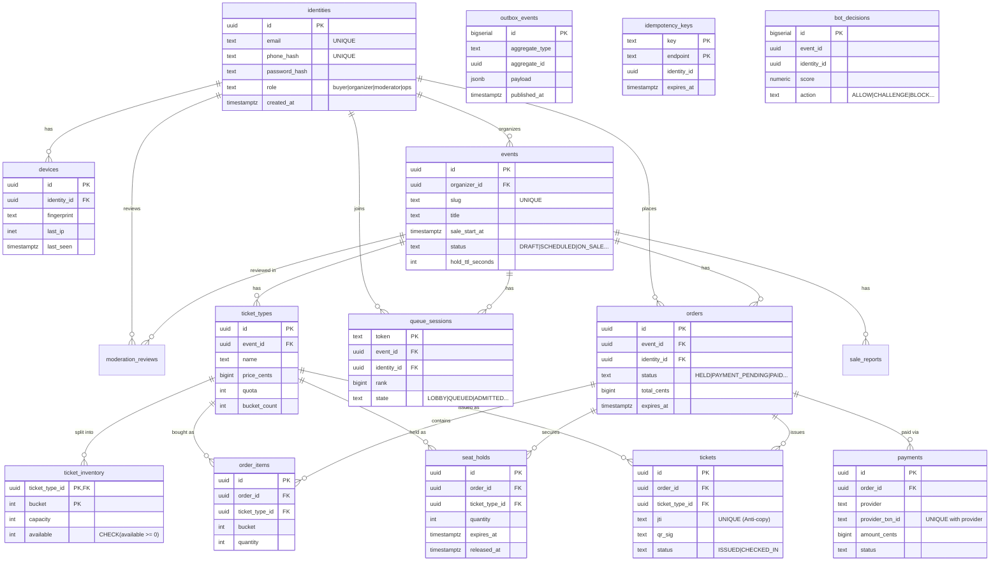
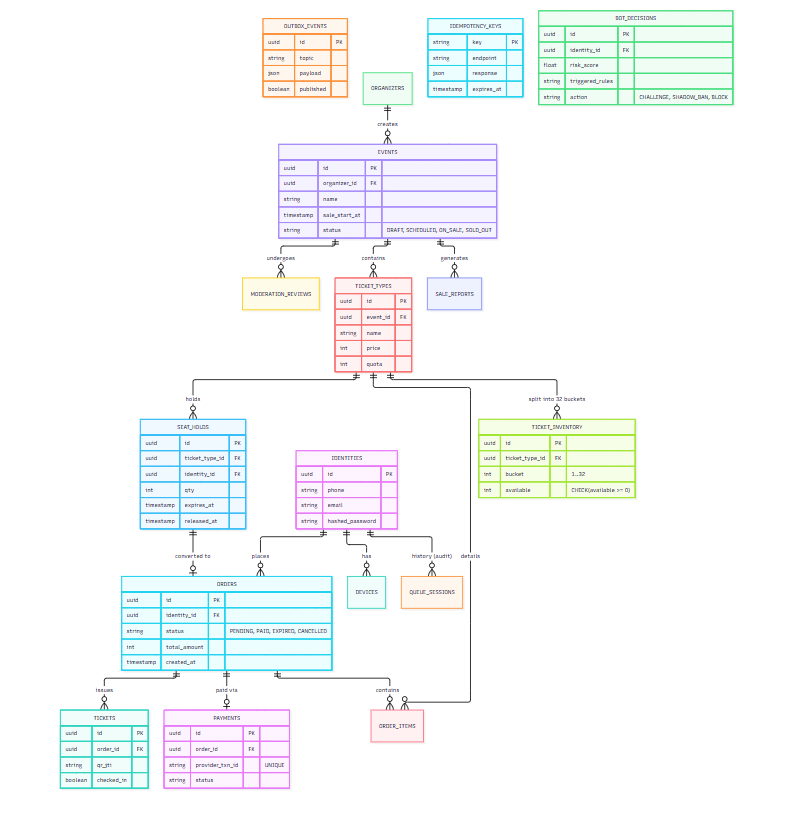

# Tài liệu Thiết kế Cơ bản - EvenFlow

Tài liệu này cung cấp các sơ đồ thiết kế ban đầu bao gồm Sơ đồ Use Case (ca sử dụng) và Lược đồ cơ sở dữ liệu (ERD) nhằm minh họa cách các tác nhân tương tác với hệ thống và cấu trúc dữ liệu cốt lõi.

---

## 1. Sơ đồ Use Case (Ca sử dụng)

Sơ đồ dưới đây mô tả tương tác giữa các tác nhân (Actors) và các chức năng chính của hệ thống.

---

## 2. Lược đồ Cơ sở dữ liệu (ERD)

Lược đồ dưới đây được kết xuất chi tiết dựa trên file migration `0001_core.sql`. Tất cả các bảng, các trường quan trọng và mối quan hệ khóa ngoại (Foreign Keys) được thể hiện chính xác so với cơ sở dữ liệu vật lý.

